# Codebase Consistency System

How the hook system, automated tests, architecture diagrams, and Greybox checks work together to keep the codebase consistent — whether you're coding interactively, using sub-agents, running agent teams, or doing rapid iteration.

## Table of Contents

- [Core Philosophy](#core-philosophy)
- [Overview](#overview)
- [Layer 1: PreToolUse Hooks](#layer-1-pretooluse-hooks-every-bash-command)
- [Layer 2: Stop Hook](#layer-2-stop-hook-after-every-turn)
- [Layer 3: Pre-Commit Checks](#layer-3-pre-commit-checks-git-commit)
- [Scenario Walkthroughs](#scenario-walkthroughs)
  - [Interactive Chat](#scenario-1-interactive-chat-you--claude)
  - [Sub-agents](#scenario-2-sub-agents-claude-spawns-helpers)
  - [Agent Teams](#scenario-3-agent-teams-parallel-implementation)
  - [Rapid Changes](#scenario-4-rapid-changes-quick-iteration-loop)
  - [Commit Flow](#scenario-5-the-commit-flow-detailed)
- [The Testing System](#the-testing-system)
- [The Greybox Enforcement System](#the-greybox-enforcement-system)
- [Architecture Diagrams](#architecture-diagrams)
- [Summary: What Protects What](#summary-what-protects-what)

---

## Core Philosophy

Three principles govern the entire system:

1. **Fast local feedback.** Every turn gets tests, typechecks, and lint. Broken code never survives to the next turn.
2. **Automated documentation.** Architecture diagrams update themselves. Humans and agents always work from current truth, not stale docs.
3. **Zero tolerance for broken types and tests.** The stop hook blocks until issues are resolved. No exceptions, no bypasses.

---

## Overview

The system has three layers of enforcement that fire at different moments:

| Layer | When it runs | Blocking? | Purpose |
|-------|-------------|-----------|---------|
| **PreToolUse hooks** | Before every Bash command | Yes (hard blocks) / No (warnings) | Prevent bad patterns, enforce tool usage, pre-commit checks |
| **Stop hook** | After every Claude Code turn that edits files | Yes (blocks until fixed) | Tests, typechecks, lint, diagram updates |
| **Pre-commit checks** | When `git commit` is executed | Yes (diagram fixer) / No (warnings) | Final validation before code enters history |

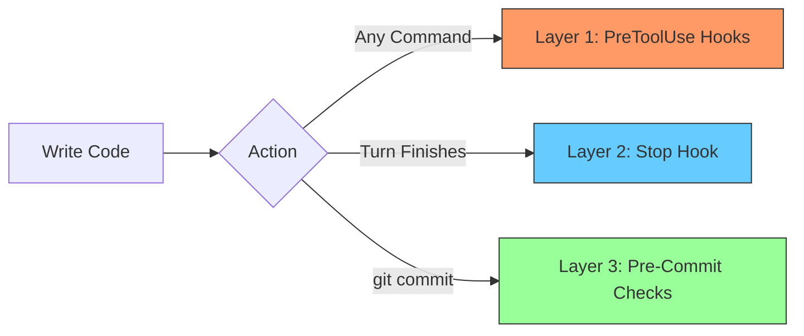

---

## Layer 1: PreToolUse Hooks (Every Bash Command)

These fire **before** every Bash tool invocation. They inspect the command and either block it (exit 2) or let it through (exit 0).

### Hard Blocks (prevent bad patterns)

| Hook | What it blocks | Why |
|------|---------------|-----|
| `block-file-reading.sh` | `cat`, `head`, `tail` | Use the Read tool instead |
| `block-file-editing.sh` | `sed -i`, `awk` with redirects | Use the Edit tool instead |
| `block-content-search.sh` | `grep`, `rg` as first command | Use the Grep tool instead |
| `block-file-search.sh` | `find`, `ls` | Use the Glob tool instead |
| `block-npm-yarn.sh` | `npm`, `yarn`, `npx` | Project uses `bun`/`bunx` exclusively |
| `block-no-verify.sh` | `--no-verify` flag | Fix the issue, don't bypass safety |
| `block-destructive.sh` | `rm -rf`, `git reset --hard`, `git push --force` | Prevent data loss |

These ensure consistent tool usage across all agents — interactive, sub-agents, and agent teams. No agent can accidentally use `npm install` or `grep` directly.

### Pre-Commit Checks (also PreToolUse hooks)

These are technically PreToolUse hooks registered on the `Bash` tool, but they only activate when the command matches `git commit*`. They live in `.claude/hooks/check-*.sh` and are registered in `.claude/settings.json` alongside the hard blocks.

| Hook | What it checks | Severity |
|------|---------------|----------|
| `check-untested-functions.sh` | Exported Convex functions with no test references | Warning |
| `check-temporal-coupling.sh` | Files in different modules that change together >60% of the time | Warning |
| `check-diagrams.sh` | Stale, unstaged, or missing architecture diagrams | **Blocking** (spawns fixer) |

---

## Layer 2: Stop Hook (After Every Turn)

The stop hook (`stop-hook.ts`) runs automatically after every Claude Code turn that edits files. It **blocks** (forces Claude to fix the issue) until all checks pass.

> [!IMPORTANT]
> **Agent Action:** If the stop hook blocks you, do not ask the user for help immediately. Read the error output, fix the code or test, and attempt the edit again. The hook will re-run automatically on your next turn.

### Check sequence

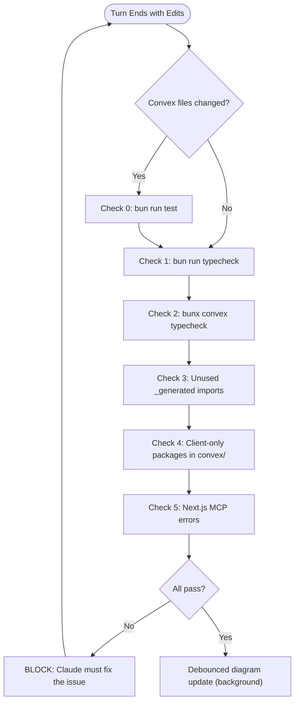

| Check | Command / Logic | Blocks on |
|-------|----------------|-----------|
| 0. Tests | `bun run test` (only if `convex/` changed) | Any test failure |
| 1. TypeScript | `bun run typecheck` | Type errors |
| 2. Convex | `bunx convex typecheck` | Schema vs function signature mismatch |
| 3. Unused imports | Scans `convex/` for dead `_generated` imports | Any found |
| 4. Client packages | Blocks React/Next/Radix in `convex/` (skips `"use node"` files) | Any found |
| 5. MCP errors | Queries `localhost:3000/_next/mcp` (skipped if dev server not running) | Real build/runtime errors |

### Diagram file-to-source mapping

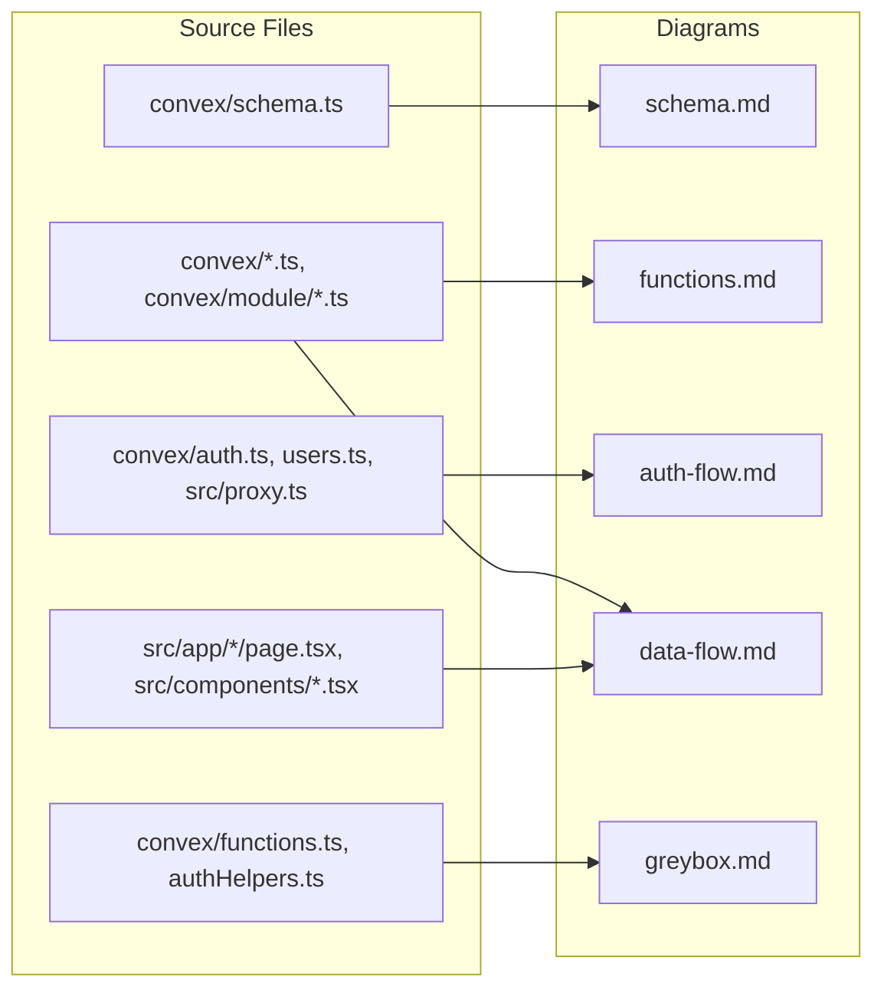

### Diagram debounce mechanism

A lock file at `/tmp/lucystarter-diagram-update.lock` prevents redundant updates:

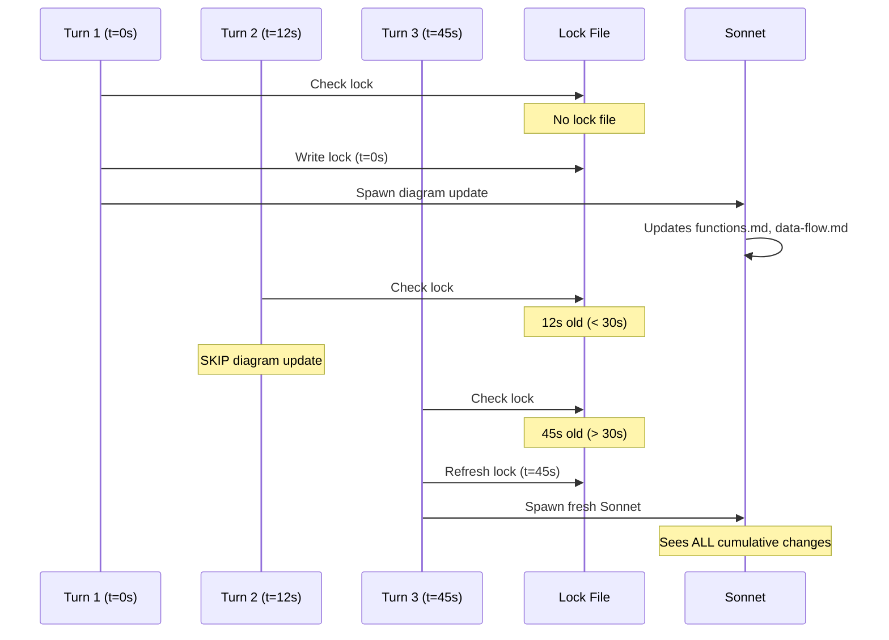

---

## Layer 3: Pre-Commit Checks (git commit)

When any agent runs `git commit`, three pre-commit hooks fire. These are PreToolUse hooks on the `Bash` tool that pattern-match the `git commit` command string.

### Untested functions warning

`check-untested-functions.sh` scans all exported Convex functions (`userQuery`, `userMutation`, `adminQuery`, `adminMutation`, `query`, `mutation`, `action`, `internalQuery`, `internalMutation`, `internalAction`) and checks if their names appear anywhere in `convex/**/__tests__/*.test.ts` files.

**Non-blocking** — prints warnings like:
```
 Untested Convex functions:
  - myNewQuery
  - myNewMutation
  Consider adding tests in convex/<service>/__tests__/
```

> [!TIP]
> **Agent Action:** If you see untested function warnings and you have time, add tests before committing. If the user asked for a quick commit, proceed but mention the warning.

### Temporal coupling warning (Greybox)

`check-temporal-coupling.sh` analyzes the last 50 commits. For any pair of files in **different** `convex/` modules that change together in >60% of commits (minimum 3 occurrences), it warns:

**Non-blocking** — prints warnings like:
```
 Greybox Warning: These files have high temporal coupling but live in different modules:
  convex/email/send.ts <-> convex/storage/files.ts (changed together in 4/5 commits)
  Consider: Should these share a Deep Module boundary?
```

This directly enforces the **Greybox Principle** — if files always change together, they should be in the same module.

> [!TIP]
> **Agent Action:** Flag temporal coupling warnings to the user. Don't refactor modules mid-task — just surface the observation so it can be addressed intentionally.

### Diagram staleness check

`check-diagrams.sh` inspects staged files and determines which diagrams they affect. It detects three kinds of staleness:

| State | Detection | What it means |
|-------|-----------|---------------|
| **missing** | Diagram file doesn't exist | New module was added but diagram never created |
| **unstaged** | Diagram has unstaged modifications | Stop hook updated it but it wasn't `git add`ed |
| **outdated** | Diagram unmodified for >5 minutes despite source changes | The 5-minute window accounts for background processing lag while ensuring diagrams aren't hours out of date |

**Blocking** — if diagrams are stale:

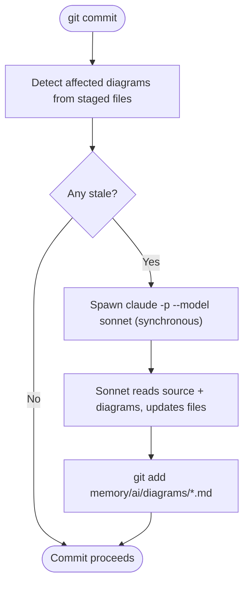

> [!IMPORTANT]
> **Agent Action:** If the diagram fixer runs, you do not need to do anything. It auto-stages the updated diagrams and the commit proceeds. If it fails (e.g., network issue), re-run the commit.

---

## Scenario Walkthroughs

### Scenario 1: Interactive Chat (you + Claude)

The most common flow. You ask Claude to implement a feature, Claude edits files, the stop hook catches issues.

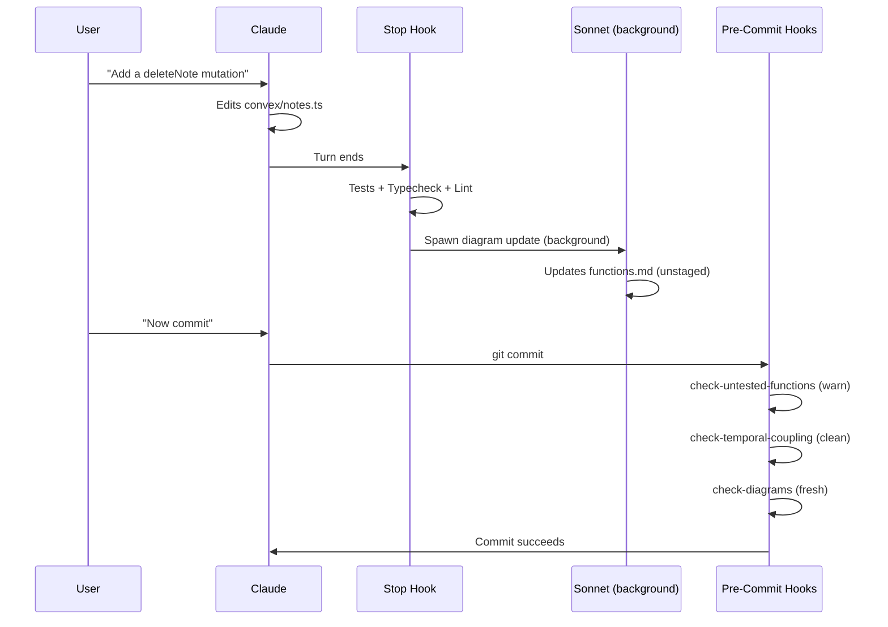

> [!TIP]
> **Key behavior:** Every turn is validated. Diagrams update in the background. Warnings at commit time remind you to add tests.

### Scenario 2: Sub-agents (Claude spawns helpers)

When Claude delegates work to sub-agents (e.g., using the Agent tool for parallel exploration), each sub-agent operates within the main session's context. The stop hook fires when the **main agent's** turn ends.

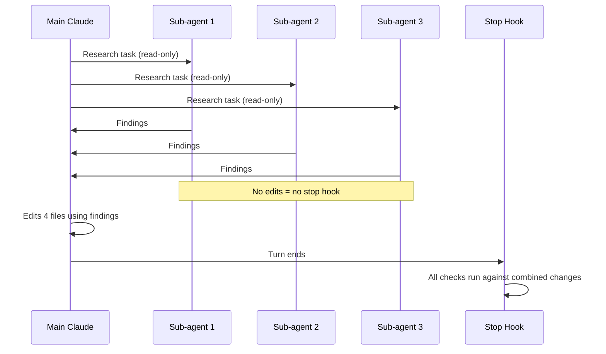

> [!TIP]
> **Key behavior:** Sub-agents that only read don't trigger the stop hook. The main agent's turn is what gets validated, covering all changes.

### Scenario 3: Agent Teams (parallel implementation)

This is the big one. You have an implementation plan with 5+ independent features, and agent teams execute them in parallel.

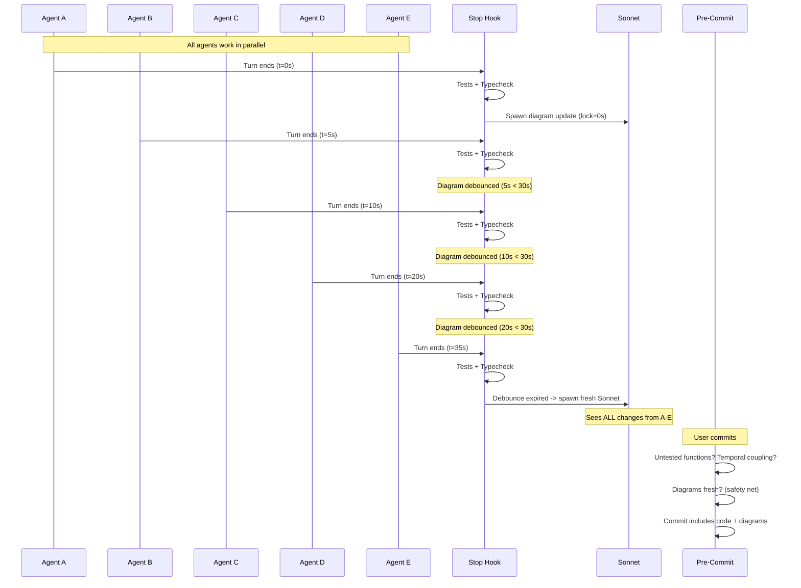

> [!IMPORTANT]
> **Key behaviors:**
> - Each agent independently gets tests + typecheck validation (no broken code merges)
> - Diagram updates are debounced — only one runs at a time, reflecting the latest state
> - The pre-commit diagram check is the safety net — if any diagram was missed, it fixes synchronously before the commit

### Scenario 4: Rapid Changes (quick iteration loop)

You're doing rapid back-and-forth: "change this", "no wait, do it this way", "actually add X too".

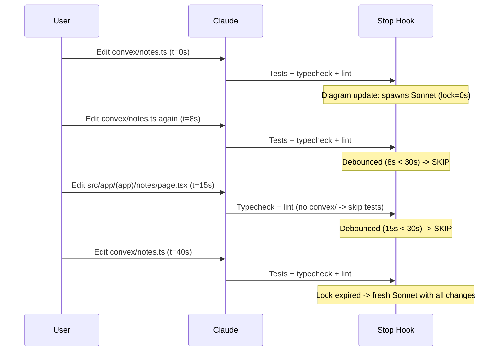

> [!TIP]
> **Key behavior:** Tests and typechecks run every turn (fast, essential). Diagram updates are batched via debounce so you don't waste cycles on intermediate states. The final diagram reflects the actual current code, not some mid-edit snapshot.

### Scenario 5: The Commit Flow (detailed)

Here's exactly what happens when any agent runs `git commit`:

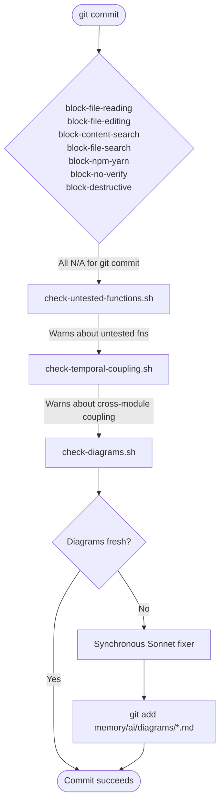

> [!IMPORTANT]
> **Agent Action:** The block hooks (file-reading, npm-yarn, etc.) all exit 0 for `git commit` since it doesn't match their patterns. The real work happens in the three `check-*` hooks. If the diagram fixer spawns, wait for it to complete — do not interrupt or retry the commit.

---

## The Testing System

### Test infrastructure

Tests live in `convex/<service>/__tests__/` using **vitest + convex-test**. The test setup (`convex/__tests__/setup.ts`) uses `import.meta.glob` to load all Convex modules, and helpers (`convex/__tests__/helpers.ts`) provide:

| Helper | Purpose |
|--------|---------|
| `createTest()` | Create a fresh convex-test instance with schema + modules |
| `createTestUser(t, opts?)` | Seed a user in DB, return authenticated test accessor |
| `createAdminUser(t, opts?)` | Seed an admin user, return authenticated test accessor |

### When tests run

| Trigger | Condition |
|---------|-----------|
| **Stop hook** | Any `convex/` file was changed in the current turn |
| **Manual** | `bun run test` |

Tests do **not** run if only frontend files changed (no `convex/` paths in the transcript).

### Test philosophy (Greybox)

Tests are **outcome-focused** — they assert results, not internal steps:

```typescript
// Good: tests the outcome
const notes = await asUser.query(api.notes.list, {});
expect(notes).toHaveLength(1);
expect(notes[0].title).toBe("My Note");

// Bad: mocks internal steps
// jest.spyOn(db, 'insert').mockResolvedValue(...)
```

The `check-untested-functions.sh` hook warns at commit time if you've added a new exported function without corresponding test coverage.

> [!IMPORTANT]
> **Agent Action:** When adding new Convex functions (queries, mutations, actions), always add tests in `convex/<service>/__tests__/`. Use `createTestUser` and `createAdminUser` from helpers — never mock auth manually. Test the outcome (what the function returns or how DB state changes), not internal implementation steps.

---

## The Greybox Enforcement System

The Greybox Principle ("Accessible but Irrelevant") is enforced at every phase — from planning through commit:

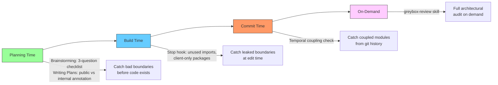

### Planning-time (brainstorming + writing plans)

This is the cheapest place to catch architectural issues — before any code is written. Enforced via CLAUDE.md instructions that apply to the brainstorming and writing-plans skills.

During **brainstorming** (design phase):
1. **Define the seam first** — what is the public API? One-sentence description.
2. **Run the three questions** — Deep? Opaque? Outcome-focused? Redesign if any answer is "no".
3. **Check existing boundaries** — read `memory/ai/diagrams/greybox.md` to see if the feature fits inside an existing module or needs its own.
4. **Identify the swap test** — name one internal detail that could change without affecting consumers.

During **writing plans** (task design):
1. **Annotate public vs internal** — mark which new files are interface and which are internals.
2. **Plan tests at the seam** — tests call the public API, not internal helpers.
3. **Flag cross-module dependencies** — if a task imports another module's internals, the boundary is wrong.

> [!IMPORTANT]
> **Agent Action:** When brainstorming or writing plans, you MUST evaluate proposed modules against the Greybox checklist before finalizing. Read `memory/ai/diagrams/greybox.md` to understand existing module structure. This is not optional — it's in CLAUDE.md.

### Design-time (documentation)

- `docs/design/greybox_principle.md` — full reference document
- `memory/ai/diagrams/greybox.md` — auto-maintained diagram showing module boundaries, public APIs vs internals

### Build-time (stop hook)

The stop hook's lint checks enforce module boundaries:
- **Unused imports** — dead imports often indicate a broken seam where something was moved into a deep module
- **Client-only packages** — React/Next.js in `convex/` means the boundary between frontend and backend leaked

### Commit-time (temporal coupling check)

`check-temporal-coupling.sh` is the Greybox enforcement at the code history level. If files in `convex/email/` and `convex/storage/` always change together, they probably belong in the same module. The hook surfaces this automatically.

### Architecture review (skill)

The `greybox-review` skill provides on-demand audits. It reads the current module structure and evaluates:
- **Depth** — does the interface hide complexity?
- **Opacity** — can you swap internals without changing consumers?
- **Outcome-focus** — do tests assert results?

---

## Architecture Diagrams

Five auto-maintained diagrams in `memory/ai/diagrams/`, plus the `## Architecture` file tree in `CLAUDE.md`:

| Document | Contents | Updated when |
|----------|----------|-------------|
| `schema.md` | ER diagram, indexes, roles, validators | `convex/schema.ts` changes |
| `functions.md` | All Convex functions, auth level, table access | Any `convex/*.ts` or `convex/<module>/*.ts` changes |
| `auth-flow.md` | Sign-in sequence, route protection, JWT flow | Auth-related files change |
| `data-flow.md` | Reactive queries, upload/chat/email flows | Any convex or frontend changes |
| `greybox.md` | Deep module boundaries, public vs internal APIs | Module structure or shared infra changes |
| **`CLAUDE.md` architecture tree** | Indented file tree with inline comments | Any structural change (new/moved files in `convex/`, `src/app/`, `src/components/`, `src/lib/`, `.claude/hooks/`) |

### Update lifecycle

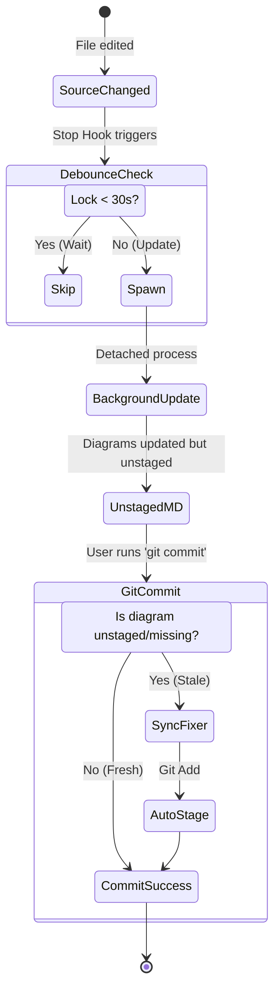

Diagrams are **never committed separately** from the code they describe. They're always part of the same commit as the source changes.

---

## Summary: What Protects What

| Concern | Protected by | When |
|---------|-------------|------|
| Wrong tool usage (cat, grep, npm) | PreToolUse block hooks | Every Bash command |
| Destructive operations | `block-destructive.sh` | Every Bash command |
| Bypassing safety checks | `block-no-verify.sh` | Every Bash command |
| Type errors | Stop hook (TypeScript + Convex typecheck) | Every turn |
| Test failures | Stop hook (`bun run test`) | Every turn touching `convex/` |
| Dead imports | Stop hook (unused _generated imports) | Every turn |
| Frontend/backend boundary | Stop hook (client-only packages) | Every turn |
| Runtime errors | Stop hook (Next.js MCP) | Every turn (if dev server running) |
| Untested functions | `check-untested-functions.sh` | Every commit (warning) |
| Cross-module coupling | `check-temporal-coupling.sh` | Every commit (warning) |
| Stale diagrams | `check-diagrams.sh` | Every commit (blocking fixer) |
| Stale CLAUDE.md architecture tree | Stop hook + `check-diagrams.sh` | Every turn + every commit |
| Diagram freshness during work | Stop hook (background Sonnet, debounced) | Every turn |
| Module boundary design (planning) | CLAUDE.md Greybox instructions | Every brainstorming + writing-plans session |
| Module boundary design (runtime) | Greybox skill + temporal coupling hook | On-demand + every commit |
