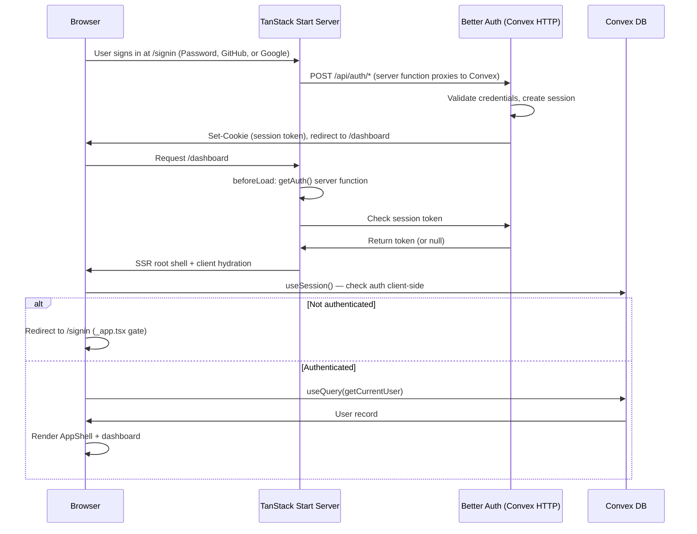
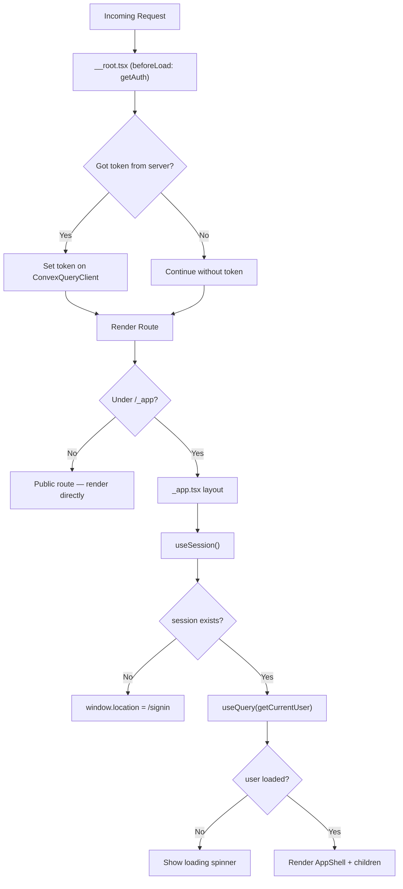
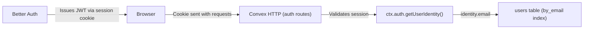
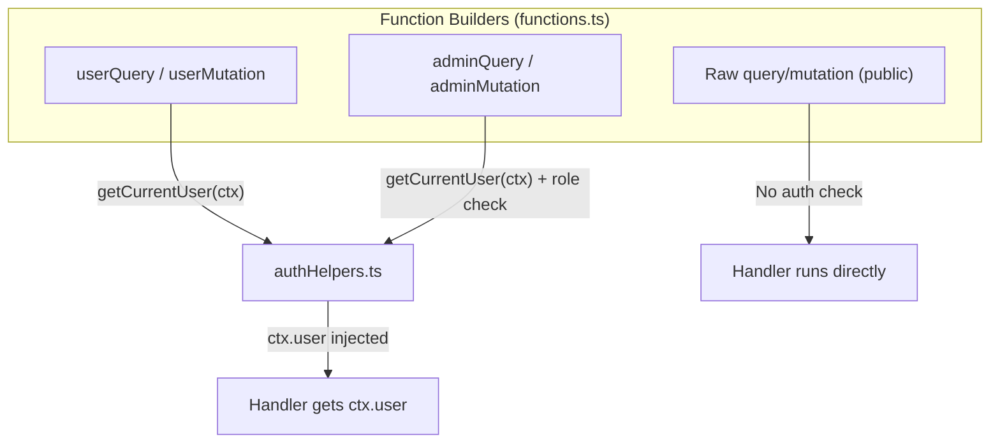

# Authentication Flow

## Sign-In Sequence

## Route Protection

## JWT Flow

## Backend Auth Layers

## Key Files

| File | Role |
|------|------|
| `convex/auth.config.ts` | Better Auth JWT config via @convex-dev/better-auth |
| `convex/auth.ts` | Better Auth providers (Email/Password, GitHub, Google) |
| `convex/authHelpers.ts` | Auth guards (getCurrentUser, requireAuth, requireAdmin, hasRole) |
| `convex/functions.ts` | Custom function builders (userQuery, userMutation, adminQuery, adminMutation) |
| `convex/users.ts` | User CRUD (getCurrentUser, updateProfile, admin operations) |
| `src/lib/auth-server.ts` | Server-side auth helpers (getToken, handler) |
| `src/lib/auth-client.ts` | Client-side auth (useSession, signIn, signUp, signOut) |
| `src/routes/__root.tsx` | SSR auth token fetch via beforeLoad |
| `src/routes/_app.tsx` | Auth gate + user query on mount |
| `src/routes/api/auth/$.ts` | Server function — proxies auth to Convex HTTP |
| `src/routes/signin.tsx` | Sign-in (Email/Password + OAuth) |
| `src/routes/signup.tsx` | Sign-up (Email/Password + OAuth) |
