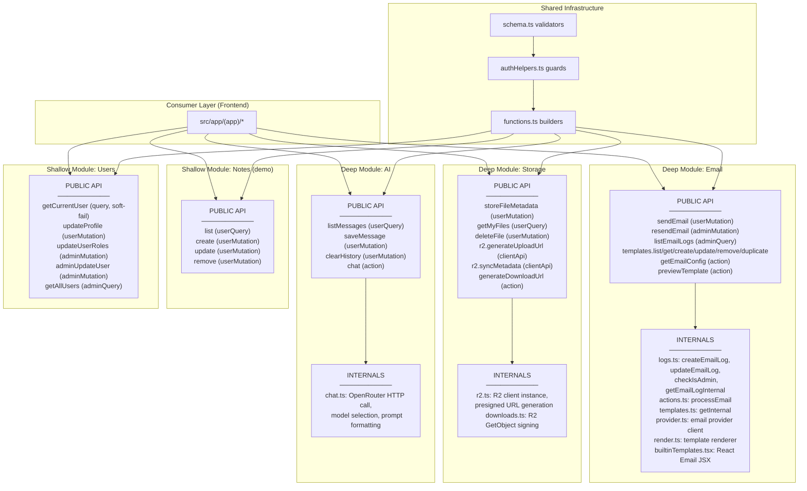

# Greybox Module Boundaries

Each deep module below has a **public interface** (what consumers use) and **internals** (hidden implementation). Consumers should only depend on the public interface. If you need to change internals, no file outside the module should break.

Reference: `docs/design/greybox_principle.md`

## Module Map



## Deep Modules — Detail

### Email (`convex/email/`)

| Aspect | Assessment |
|--------|------------|
| **Depth** | Deep — 6 public exports hide 7 internal functions, template rendering, provider abstraction, and scheduler-based async delivery |
| **Opacity** | Opaque — consumers call `sendEmail()` and never know about Resend vs SMTP, template rendering, or retry logic |
| **Seam** | `api.email.send.*` + `api.email.templates.*` — stable interface regardless of provider |

| Layer | Files | What it hides |
|-------|-------|---------------|
| Public interface | `send.ts`, `templates.ts`, `templateActions.ts` | Stable function signatures |
| Internal plumbing | `logs.ts`, `actions.ts` | Log lifecycle, delivery scheduling |
| Provider abstraction | `provider.ts` | Resend vs SMTP selection, API keys |
| Rendering engine | `render.ts`, `builtinTemplates.tsx` | React Email JSX, HTML compilation |

**Swap test:** You could replace Resend with SendGrid by changing only `provider.ts`. No consumer changes needed.

### Storage (`convex/storage/`)

| Aspect | Assessment |
|--------|------------|
| **Depth** | Deep — 6 public exports hide R2 client setup, presigned URL generation, and direct browser upload orchestration |
| **Opacity** | Opaque — consumers call `storeFileMetadata()` and `generateUploadUrl()` without knowing about S3-compatible APIs or presigning |
| **Seam** | `api.storage.files.*` + `api.storage.r2.*` + `api.storage.downloads.*` |

| Layer | Files | What it hides |
|-------|-------|---------------|
| Public interface | `files.ts`, `r2.ts` (clientApi) | Metadata CRUD, upload URLs |
| Download generation | `downloads.ts` | R2 GetObject presigning |
| R2 client | `r2.ts` (internal) | `@convex-dev/r2` component, bucket config |

**Swap test:** You could replace R2 with S3 or GCS by changing `r2.ts` internals. Consumer code unchanged.

### AI (`convex/ai/`)

| Aspect | Assessment |
|--------|------------|
| **Depth** | Deep — 4 public exports hide OpenRouter HTTP integration, model selection, and prompt formatting |
| **Opacity** | Opaque — consumers call `chat()` and get back `{ content, model, usage }` without knowing the provider |
| **Seam** | `api.ai.messages.*` + `api.ai.chat.*` |

| Layer | Files | What it hides |
|-------|-------|---------------|
| Public interface | `messages.ts` | Message CRUD |
| LLM integration | `chat.ts` | OpenRouter API call, model config, response parsing |

**Swap test:** You could replace OpenRouter with direct OpenAI or Anthropic SDK by changing `chat.ts`. No consumer changes needed.

## Shared Infrastructure (not deep modules — intentionally shallow)

### Function Builders (`convex/functions.ts`)

Thin wrappers that inject `ctx.user` and role checks. Intentionally shallow — the "depth" lives in the modules that use them.

| Builder | Injected behavior |
|---------|-------------------|
| `userQuery` | Auth check + `ctx.user` injection |
| `userMutation` | Auth check + `ctx.user` injection |
| `adminQuery` | Auth + admin role check + `ctx.user` |
| `adminMutation` | Auth + admin role check + `ctx.user` |

### Auth Guards (`convex/authHelpers.ts`)

Utility functions consumed by builders. Not a deep module — just helpers.

### Schema Validators (`convex/schema.ts`)

Shared type definitions. Consumed everywhere. Changes here have high gravity (intentional — schema is foundational).

## Shallow Modules (acceptable)

| Module | Why shallow is OK |
|--------|-------------------|
| `notes.ts` | Demo CRUD, no hidden complexity to encapsulate |
| `users.ts` | Thin layer over Convex Auth's user management |

## Adding a New Deep Module

When creating a new feature module, ensure it follows this structure:

```
convex/your-feature/
  index.ts or feature.ts     # PUBLIC: exported queries/mutations (the seam)
  featureActions.ts           # PUBLIC: exported actions ("use node")
  internal-helper.ts          # INTERNAL: not imported outside this folder
  provider.ts                 # INTERNAL: external service abstraction

tests/convex/your-feature/
  feature.test.ts             # Tests assert outcomes, not internal steps
```

**Checklist before adding:**
1. Can you describe the public API in one sentence?
2. Could you swap the internal implementation without changing consumers?
3. Do files outside this folder only import from the public interface files?
